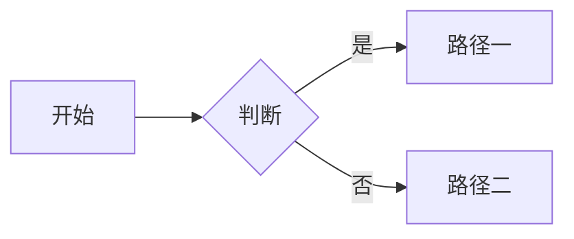
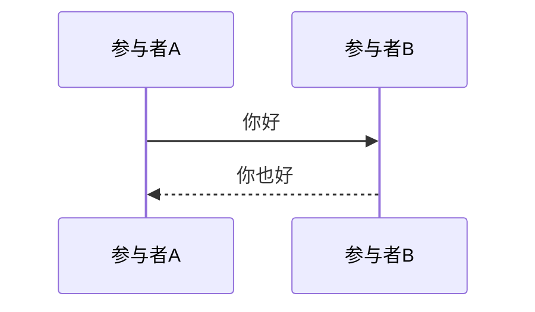

# Markdown 语法演示

本文展示站点支持的全部 Markdown 语法。删掉它不影响站点,重新执行种子脚本也不会把它找回。

## 1. 基础排版(L1 基座)

**加粗**、*斜体*、~~删除线~~、`行内代码`、<https://example.com> 自动链接、[普通链接](https://example.com) 与 [引用式链接][ref]。

[ref]: https://example.com "引用式链接的标题"

有序列表从 3 开始计数:

3. 第三项
4. 第四项

- 无序列表
	- 嵌套的子项
- [ ] 待办事项(未勾选)
- [x] 待办事项(已勾选)

> 普通引用
>
> > 嵌套的第二层引用

---

| 左对齐 | 居中 | 右对齐 |
| :----- | :--: | -----: |
| A      | **B** |    `C` |
| 行内 ==高亮== 也可用 | @gh:someone | 10 |

站内图片(自托管,任何网络环境恒可达):

 {width=480}

外链图片(placehold.co):


引用式图片:

![引用式图片][img]

[img]: /demo/sample-2.svg

## 2. 行内扩展(L2 封闭集)

行内代码内的定界符保持字面:`||不是剧透||`、`==不是高亮==`、`@gh:不是提及`、`$不是数学$`。

高亮:==重点标记文本==;剧透:||这里是点击前不可见的内容||;提及:@gh:torvalds、@tw:jack、@tg:durov。

转义演示:\|\|这不是剧透\|\|、\==不是高亮\==、\@gh:不是提及、\$5 不是数学。

行内数学:$E = mc^2$ 与 \(a^2 + b^2 = c^2\) 等价;贴靠护栏:价格 $5 与 a == b == c 均不触发语法。

脚注引用[^note],以及行内脚注^[这是一条行内脚注]。

[^note]: 这是脚注 `[^note]` 的定义文本。

### 带自定义锚点的标题 {#custom-anchor}

## 3. 告警(GitHub Alerts 五种)

> [!NOTE] 可选的自定义标题
> 内部支持 **Markdown**、列表与嵌套引用。
>
> > 这是告警内的嵌套引用

> [!TIP]
> 提示内容。

> [!IMPORTANT]
> 重要内容。

> [!WARNING]
> 警告内容。

> [!CAUTION]
> 危险内容。

## 4. 容器(封闭注册表)

图片网格(每行按图片处理):

:::grid {cols=3 gap=8 layout=grid}


:::

文字网格:

:::grid {cols=2 type=normal}
左边的一格文字,支持 **Markdown**。
右边的一格文字。
:::

标签页:

:::tabs
:::tab label="第一个标签"
第一页内容,支持 **Markdown** 与列表。
:::
:::tab label="第二个标签"
第二页内容。
:::
:::

折叠面板(默认收起):

:::details summary="折叠面板"
点击标题才会展开的内容。
:::

折叠面板(默认展开):

:::details summary="默认展开的面板" open
这个面板第一次渲染就是展开状态。
:::

块级剧透:

:::spoiler label="块级剧透"
点击后才显示的大段隐藏内容。
:::

瀑布流:

:::grid {cols=3 layout=masonry}


:::

轮播:

:::grid {layout=carousel}


:::

## 5. 代码块

折叠到第 3 行:

```ts {collapsed=3 title="折叠示例"}
export function greet(name: string): string {
	return `Hello, ${name}`;
}

console.log(greet('world'));
console.log('第二行输出');
console.log('第三行输出');
```

带标题不折叠:

```json {title="配置文件"}
{ "feature": true }
```

关闭行号:

```text {linenos=off}
no line numbers here
```

Svelte 组件:

```svelte
<script lang="ts">
	let count = $state(0);
</script>

<button onclick={() => count++}>{count}</button>
```

未知语言回退纯文本:

```unknownlang
plain text fallback
```

## 6. 数学(KaTeX)

行内:$e^{i\pi} + 1 = 0$。

块级:

$$
\int_{-\infty}^{\infty} e^{-x^2} \, dx = \sqrt{\pi}
$$

## 7. Mermaid 图表





## 8. 嵌入卡片

GitHub 仓库:


YouTube 视频:


B 站视频:


arXiv 论文:


未命中提供方时的通用卡片(零网络请求):


裸链接永远保持普通链接:<https://example.com/bare-url>

## 9. 原始 HTML 白名单

行内标签:<tag>示例标签</tag>、<kbd>Ctrl</kbd>+<kbd>C</kbd>、原生 <mark>mark</mark>、<ins>ins</ins>、<del>del</del>、<sup>上标</sup>、<sub>下标</sub>。

<details>
<summary>面板元素</summary>

`details` / `summary` 也是白名单元素。

</details>

音频(SoundHelix 测试样例):

<audio controls src="https://www.soundhelix.com/examples/mp3/SoundHelix-Song-1.mp3"></audio>

视频(W3C 官方测试媒体,Sintel 预告片):

<video controls src="https://media.w3.org/2010/05/sintel/trailer.mp4" width="480"></video>
